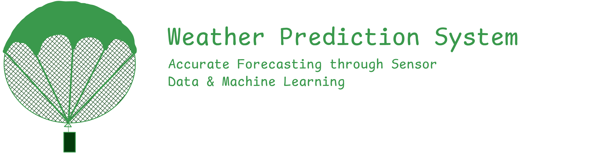

# Weather Prediction System

## Project Overview

This project aims to solve a real-world problem of inaccurate and localized weather predictions. It focuses on integrating sensor data with machine learning algorithms to create a more precise, real-time weather forecasting tool. By leveraging **High Altitude Data Collectors (HADCs)** and **Low Altitude Data Collectors (LADCs)**, we aim to provide better insights for short-term planning in various fields such as agriculture, disaster management, and urban planning.

This repository contains both the **app** and **hardware code** required to set up and operate the weather prediction system.

> [!NOTE]
> This is a **school project** undertaken by students to explore how modern technologies can improve weather prediction systems.  
> For more details, check the [documentation](docs/main.pdf).

## High Altitude Data Collectors (HADCs)

HADCs are systems equipped with sensors and attached to balloons. These balloons are sent to high altitudes, where the data collected helps in understanding weather patterns at different heights.

However, there are certain challenges with this method:

- **Balloon Bursting**: When these balloons reach a certain altitude, they burst due to the decreasing pressure at high altitudes. Upon bursting, the device filled with sensors falls to the ground and gets damaged, making it unusable for future missions.

To address this issue, we propose the introduction of a **parachute system**, which allows the devices to descend safely and be reused in future missions. This improves the reliability and cost-effectiveness of weather data collection.

> [!IMPORTANT]  
> **We require the hardware (HADCs and LADCs) for collecting data** to fully utilize the potential of this weather prediction system. Without the physical sensors and data collectors, the system cannot function or provide accurate data.

## Devices Used

- **HADCs**: These are used to collect data from high altitudes, providing insights into atmospheric conditions such as temperature, humidity, and air quality.
- **LADCs**: These are used to collect data from lower altitudes, complementing the high-altitude data to create a comprehensive weather model.

## Setup and Configuration

### Required Devices

To implement this system, we require the following devices for collecting data:

- **HADCs (High Altitude Data Collectors)**
- **LADCs (Low Altitude Data Collectors)**

### Connections and Hardware Setup

To prepare your devices, follow the instructions provided in the [connections guide](docs/connections.md). This guide will walk you through the necessary steps to connect your sensors and ensure proper functionality of the system.

## How It Works

1. **Data Collection**: HADCs and LADCs collect data at different altitudes. This data includes temperature, humidity, and air quality information.
2. **Processing & Prediction**: The data is processed using machine learning algorithms to generate short-term weather forecasts.
3. **Real-time Access**: Users can access real-time data and weather predictions through the app.

## Future Implementation

- **Deployment**: Once successful testing is complete, we will deploy the system and continuously monitor its performance.
- **Expansion**: We plan to deploy permanent LADCs and HADCs in selected locations to expand the system's impact, providing more comprehensive insights for improved weather predictions.

## Contributions

If you'd like to contribute to this project, feel free to open a pull request or issue. Contributions are welcome!

## License

This project is licensed under the **GPL-3.0** License. See the [LICENSE](LICENSE) file for details.
